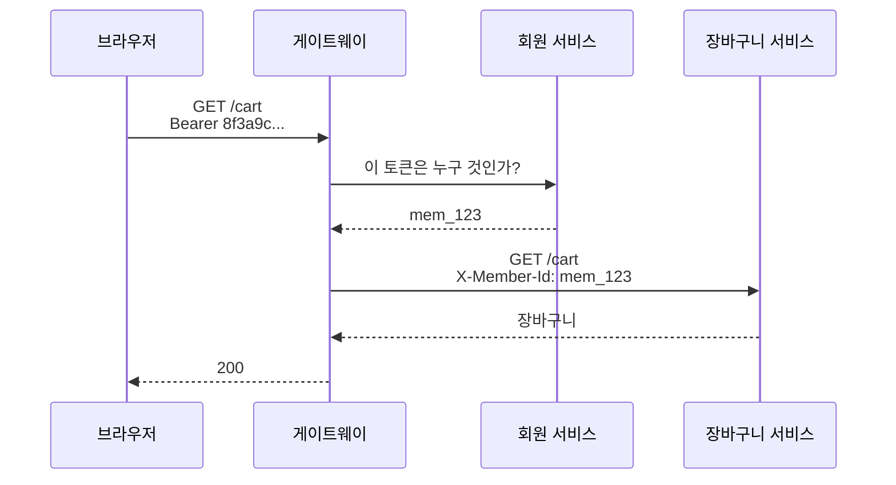
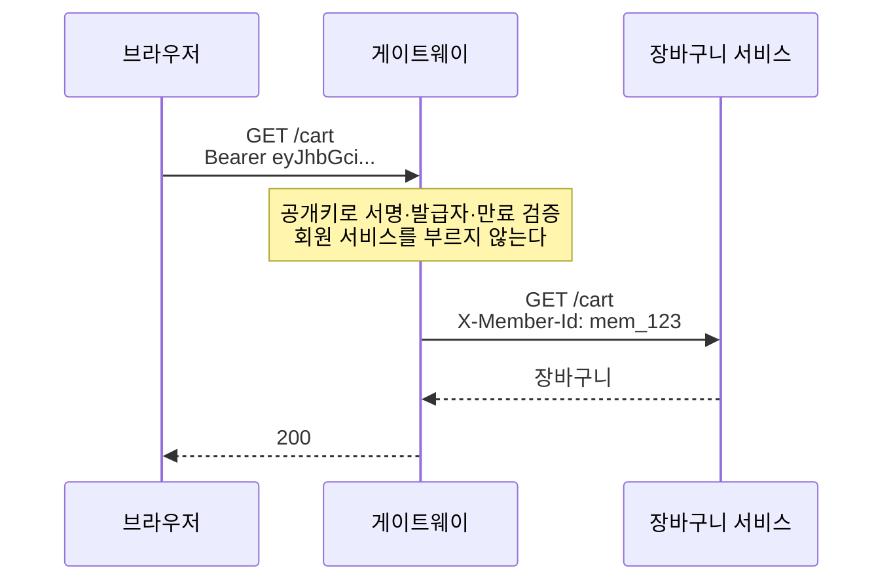
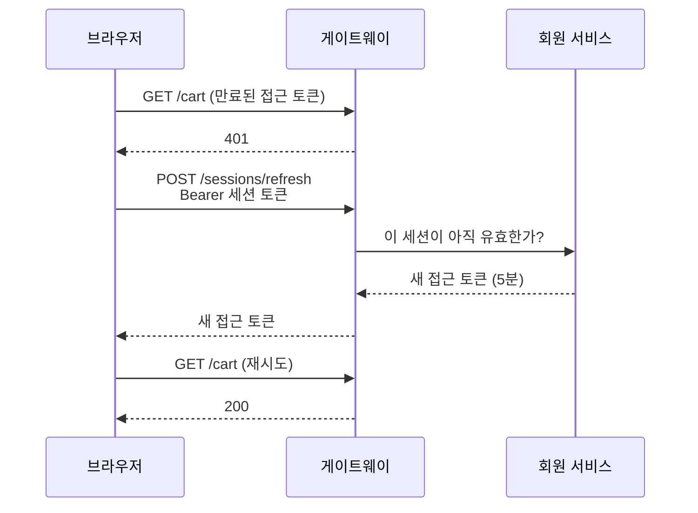
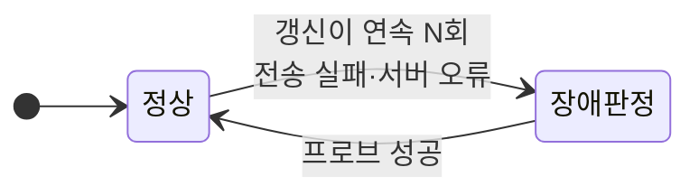

## 들어가며

마이크로서비스 앞에 게이트웨이를 두면 반드시 마주치는 질문이 있다. **게이트웨이는 요청자가 누구인지 어떻게 아는가.**

가장 흔한 답은 세션 토큰을 받아 인증 서버에 물어보는 것이다. 단순하고, 로그아웃이 즉시 반영되고, 무엇보다 이해하기 쉽다. 나도 그렇게 만들었다.

그런데 이 구조에는 조용한 대가가 하나 붙어 있다. **인증 서버가 죽으면 로그인한 모든 사용자의 모든 요청이 죽는다.** 상품 목록은 보이는데 장바구니와 주문은 전부 실패한다.

이 글은 그 대가를 다시 계산해서 구조를 뒤집은 과정이다. 결론부터 적으면 **"폐기는 즉시여야 한다"는 전제를 버리고 대신 인증의 가용성을 얻었다.** 무엇을 근거로 그 전제를 버릴 수 있었는지, 그리고 얻고 나서야 보인 새 한계가 무엇인지를 정리했다.

---

## 처음의 구조

10개 서비스 앞에 API 게이트웨이가 하나 있다. 브라우저는 게이트웨이만 보고, 게이트웨이가 신원을 확인해 하위 서비스에 `X-Member-Id` 헤더로 넘긴다. 하위 서비스는 토큰을 모르고 그 헤더만 믿는다.

현재는 회원 서비스가 세션 발급·조회·폐기까지 맡고 있다. 따라서 이 글에서 **회원 서비스는 인증 요청을 처리하는 인증 서버이기도 하다.**

신원 확인 방식으로 고른 것은 **불투명 토큰(opaque token)** 이었다. 로그인하면 서버가 이런 문자열을 준다.

```
8f3a9c2d1e7b4a06f5c8d3e9b2a7f1c4...
```

256비트 난수다. **이 문자열 자체에는 아무 정보가 없다.** 누구 것인지, 언제까지 유효한지, 폐기됐는지 — 전부 인증 서버의 DB에만 있다. 들여다봐도 안이 안 보이니 "불투명"이다.

옷 보관소 번호표를 생각하면 된다. 번호표엔 "17"만 적혀 있고, 그게 누구 코트인지는 **보관소 장부**에만 있다.



**요청마다 화살표가 하나 더 있다.** 이게 이 구조의 전부이자 문제다.

세션에는 처음부터 만료가 있었다. 발급 후 14일이고, 사용해도 연장되지 않는다. 그러니까 이 글에서 나중에 바뀌는 것은 **만료의 유무가 아니라 "폐기가 언제 반영되는가"** 다. 둘은 다른 이야기다.

이 방식을 고른 이유는 하나였다. **폐기 즉시성.** 로그아웃하면 서버가 세션을 폐기하고, 다음 요청부터 바로 막힌다. 매번 장부를 보니 당연하다.

당시 결정 문서에는 이 선택이 만든 리스크도 함께 적혀 있었다.

> **발급자 장애가 전체 인증 장애가 된다.** 회원 서비스가 죽으면 이미 로그인한 사용자의 모든 요청이 실패한다.
>

그리고 뒤집을 조건까지.

> 회원 서비스 장애가 전체 인증을 끊는 것이 실제 문제가 된다 → 하이브리드.
>

**이 두 줄이 나중에 결정을 뒤집는 근거가 됐다.** 결정할 때 무엇을 포기하는지 아는 것과 그것을 적어 두는 것은 다른 일이다. 적어 두지 않았다면 이번 변경은 취향 논쟁이 됐을 것이다.

---

## 증상이 기록보다 나빴다

구조를 손보려고 코드를 열었을 때, 장애의 실제 모습이 기록과 달랐다.

기록은 "요청이 실패한다"였다. 실제로는 **사용자가 로그아웃당했다.**

게이트웨이가 인증 서버 호출을 감싼 예외 처리가 이랬다.

```java
} catch (RestClientResponseException exception) {
    throw unauthorized();   // 4xx도 5xx도 전부 401
}
```

인증 서버가 500을 내면 게이트웨이는 **"당신 세션이 유효하지 않습니다"(401)** 라고 답한다. 서버 문제를 사용자 문제로 번역해서 알리는 것이다. 그리고 프론트가 401을 받으면 토큰을 지웠다.

세션은 서버에 14일 살아 있는데 클라이언트가 버린다. 읽기 타임아웃이 3초였으니 **인증 서버가 3초만 느려져도 그 순간 페이지를 연 사용자가 전원 로그아웃**됐다. 장애가 끝나도 자동으로 복구되지 않는다. 토큰이 이미 없으니까.

여기서 판단이 하나 갈렸다. **이건 결합의 증상이지 결합 자체가 아니다.** 캐시를 붙이든 구조를 바꾸든 실패 경로는 여전히 존재하고 그때 이 코드가 돈다. 즉 **어느 방향을 고르든 남는 결함**이다.

그래서 큰 결정을 하기 전에 이것만 떼어내 먼저 고쳤다. 인증 서버가 "세션 없음"이라고 답한 경우만 401로 두고, 서버 오류와 전송 실패는 503으로 나눴다. 프론트는 401일 때만 토큰을 버리게 했다.

결합은 그대로 남았지만 **가장 아픈 증상이 사라졌다.** 그리고 정책을 논의하는 동안에도 사용자는 이미 이득을 봤다.

> 큰 결정 앞에서 멈추기 전에, **그 결정과 무관하게 참인 결함**이 섞여 있는지 확인할 만하다. 그건 지금 고칠 수 있다.
>

---

## 즉시성은 얼마나 값어치가 있었나

본론이다. 요청당 조회를 없애려면 폐기가 늦어지는 것을 받아들여야 한다. 그 거래가 남는 장사인가?

먼저 **폐기 즉시성이 실제로 덮고 있는 범위**를 확인했다. 원래 근거는 셋이었다 — 로그아웃, 비밀번호 변경, 계정 정지. 그런데 세션을 확인하는 코드가 이랬다.

```java
var session = sessionRepository.findByTokenHash(hash(rawToken))
        .filter(candidate -> candidate.isUsable(now))   // 폐기 여부와 만료만 본다
        .orElseThrow(...);
return new SessionOwner(session.memberId());
```

**회원이 어떤 상태인지는 조회하지도 않는다.** 계정 정지 기능을 붙여도 이 구조에서는 반영되지 않는다. 매 요청 장부를 보는 값을 치르면서, 정작 그 장부에서 회원 상태는 읽지 않고 있었다.

**대가는 다 치르는데 이득은 일부만 걷고 있었던 것이다.**

다만 이걸 "그러니 지연을 받아들여도 싸다"는 근거로 쓰지는 않았다. 지금 기능이 없다는 것은 고칠 대상이지 판단의 전제가 아니다. 그래서 **셋을 다 있다고 놓고** 다시 계산했다.

폐기가 필요한 상황에서 실제 노출 시간은 세 구간의 합이다.

| 상황 | 인지 | 대응 | 전파 |
| --- | --- | --- | --- |
| 계정 탈취를 사용자가 눈치챔 | 수 시간~수 일 | 수 분 | ? |
| 기기 분실 | 수 분~수 시간 | 수 분 | ? |
| 로그아웃 | 해당 없음 (공격자가 없다) | 즉시 | ? |

**앞의 두 구간이 압도적이다.** 마지막 구간만 0으로 만드는 데 인증 전체의 가용성을 지불하는 것은 균형이 맞지 않는다. 다른 게 다 느린데 마지막 한 칸만 빠르게 만들려고 큰 비용을 쓰는 셈이다.

그래서 **정상 동작 중 폐기 반영 상한을 5분으로 정했다.** "즉시"가 "5분 안에"가 됐다.

폐기 사유별로 상한을 다르게 둘 수도 있었다. 로그아웃은 느슨하게, 계정 정지는 즉시로. 실제 서비스가 흔히 그렇게 한다. 두지 않기로 한 이유는 **일부만 즉시로 유지하려면 긴급 폐기를 검증자에게 밀어 넣는 별도 경로가 필요하고, 위의 논거가 보안 사유에도 그대로 적용되기 때문**이다. 필요해지면 그때 다시 본다.

---

## 물어보지 않고 확인하는 법

핵심 질문은 하나다. **물어보지 않고도 신원을 확인할 수 있는가?**

불투명 토큰은 안 된다. 정보가 토큰에 없으니까. 그래서 발상을 뒤집는다. **토큰에 정보를 직접 담는다.**

```json
{"sub": "mem_123", "exp": 1755950400}
```

읽는 순간 누구인지 안다. 당연한 반문이 나온다 — 공격자가 `{"sub": "mem_admin"}`이라고 써서 보내면?

그래서 **서명**이 붙는다. 발급자가 비밀 키로 내용에 대한 서명값을 계산해 붙이고, 검증자는 키로 "이 내용과 이 서명이 짝이 맞는가"를 확인한다. 내용을 한 글자라도 바꾸면 안 맞고, 키가 없으면 유효한 서명을 만들 수 없다.

번호표가 아니라 **위조 방지 인장이 찍힌 신분증**이다. 이름이 적혀 있고 인장이 진짜인지는 그 자리에서 확인된다. 장부를 볼 필요가 없다. 이런 클레임을 담는 형식이 JWT이고, 여기서는 JWS 방식으로 서명한다.

### 그럼 서명 토큰만 쓰면 되지 않나

안 된다. **이미 발급한 신분증을 어떻게 회수하나?** 검증자가 장부를 안 보니 "취소됐다"는 사실을 알 방법이 없다.

폐기된 토큰 목록을 매 요청 확인하면 되지 않느냐 — **매번 조회하는 순간 불투명 토큰과 똑같아진다.** 물어보지 않으려고 서명을 도입했는데 다시 물어보게 되니 이점이 사라진다.

남는 답은 하나다. **유효기간을 아주 짧게 만든다.** 신분증 수명이 5분이면 회수할 필요가 없다. 가만 놔둬도 알아서 무효가 된다. 대신 5분마다 새로 받아야 하고, **새로 받을 때 장부를 확인하면 된다.**

### 하이브리드

토큰을 둘로 나눈다.

|  | **접근 토큰** | **세션 토큰** |
| --- | --- | --- |
| 형태 | 서명 토큰 | 불투명 토큰 |
| 수명 | 5분 | 14일 |
| 언제 쓰나 | 모든 요청 | 접근 토큰이 만료됐을 때만 |
| 누가 검증 | 게이트웨이가 로컬에서 | 회원 서비스가 DB 조회로 |
| 호출 빈도 | 초당 수백~수천 | 사용자당 5분에 한 번 |

한 줄로 요약하면 이렇다.

> **자주 쓰는 것은 조회가 필요 없게 만들고, 조회가 필요한 것은 드물게 쓰게 만든다.**
>

일반 요청에서 화살표 하나가 사라진다.



조회는 5분에 한 번, 갱신할 때만 일어난다.



폐기는 세션에만 건다. 로그아웃하면 세션이 폐기되고, 이미 발급된 접근 토큰은 남은 수명 동안 동작하다가 갱신 시점에 거절된다. **접근 토큰 수명이 곧 폐기 지연 상한이며 두 값은 같은 값이다.** 앞서 정한 5분이 바로 이 수명이다.

### 변경을 작게 만든 프레이밍

이 작업을 작게 만든 것은 하나의 관점이었다.

> **기존 세션은 그대로 둔다. 접근 토큰은 그 세션에서 파생되는 5분짜리 증명서다.**
>

기존 세션 테이블이 갖고 있던 것 — 토큰 해시, 회원 id, 만료 시각, 폐기 시각 — 은 갱신 자격증명에 필요한 것과 정확히 같았다. 개념도 같다. 장수명이고, 폐기 가능하고, 해시로 저장한다.

그래서 **새 타입도 마이그레이션도 만들지 않았다.** 기존에 "세션 토큰"이라 부르던 것이 갱신 역할을 그대로 맡았고, 세션에 대한 규칙들(다중 세션 허용, 14일 만료, 로그아웃 시 폐기)이 손댈 것 없이 그대로 성립했다.

새 개념을 도입할 때 기존 개념을 어디까지 재사용할 수 있는지 먼저 보는 것이 변경 크기를 크게 좌우한다.

### 대칭 키를 쓰지 않은 이유

서명 키에는 두 방식이 있다. 발급자와 검증자가 같은 비밀 키를 나눠 갖거나(대칭), 발급자가 개인키로 서명하고 검증자는 공개키로 검증만 하거나(비대칭).

검증자가 게이트웨이 하나뿐이니 대칭이 단순하다. 그런데 **게이트웨이는 유일한 퍼블릭 인그레스, 가장 먼저 침해되는 자리다.** 대칭 키라면 검증 키가 곧 발급 키이므로 키가 유출됐을 때 게이트웨이 밖에서도 임의의 접근 토큰을 만들 수 있다. 공개키만 두면 게이트웨이의 키가 유출돼도 새 토큰을 서명할 수는 없다. 물론 실행 중인 게이트웨이 자체가 장악된 상황까지 막는다는 뜻은 아니다.

비용 차이는 설정 수준이었다. 노출도가 다른 컴포넌트에 같은 권한을 주지 않는다는 원칙이 이 정도 비용이면 지킬 만하다.

담는 값은 회원 식별자와 시각 정보만으로 정했다. **서명은 위조를 막을 뿐 내용을 감추지 않으므로** 담은 것은 누구나 읽을 수 있다. 권한을 담지 않은 이유는 따로 있는데, **담으면 폐기 지연이 권한 변경에도 적용되기 때문**이다.

---

## 5분으로는 부족했다

여기까지 하고 인증 서버를 죽여 봤다. 유효한 접근 토큰으로 보낸 요청이 200을 돌려줬다. 목표가 달성된 것처럼 보였다.

그런데 **내성이 접근 토큰 수명인 5분까지였다.** 5분이 지나면 갱신하러 가야 하고 그 경로는 인증 서버에 의존한다. 배포 롤백, DB 페일오버, 노드 교체는 대개 5분보다 오래 걸린다. **가장 흔한 크기의 장애를 못 넘는다.**

그래서 상한을 하나 더 뒀다. **장애로 판정되는 동안에는 폐기 반영 상한을 24시간으로 늘린다.**

길게 느껴지지만 근거가 명확하다. **장애 중에는 폐기 자체가 불가능하다.** 폐기를 기록하는 저장소가 인증 서버이므로 그게 죽으면 로그아웃 요청도 실패한다. 장애 중 상한을 짧게 잡아서 막을 수 있는 것은 "장애 직전에 이미 기록된 폐기가 늦게 반영되는 것" 하나뿐이고, 그 대가로 사용자는 확실히 끊긴다. **거래가 한쪽으로 완전히 기울어 있다.**

동작은 단순하다. 장애로 판정된 동안 게이트웨이는 **만료 판정만** 완화한다. 서명과 발급자 검증은 그대로다.

---

## 장애를 어떻게 판정할 것인가

"장애로 판정된다"를 무엇으로 정할 것인가. 여기서 **서킷 브레이커(circuit breaker)** 라는 오래된 패턴이 맞는 모양이었다.

이름 그대로 두꺼비집이다. 상대 서비스 호출이 연달아 실패하면 브레이커가 **열리고(open)**, 열린 동안에는 아예 부르지 않는다. 이미 죽은 상대에게 요청을 계속 던져 봐야 응답을 기다리는 시간만 쌓이고 상대의 회복도 방해하기 때문이다.

문제는 **언제 다시 부를 것인가**다. 영원히 안 부르면 상대가 살아나도 모른다. 그래서 표준적인 브레이커는 일정 시간이 지나면 **반열림(half-open)** 상태가 되어 시험 삼아 한 번 불러 본다. 이 시험 호출을 **프로브(probe)** 라고 한다. 성공하면 닫고, 실패하면 다시 열어 둔다.

우리 경우 여는 조건은 명확했다. **전송 실패와 서버 오류만 센다.** 폐기된 세션의 갱신 거절은 정상 동작이고, 그것으로 브레이커가 열리면 **로그아웃한 사용자 몇 명이 전체를 완화 모드로 밀어 넣는다.**



| 상태 | 만료된 접근 토큰 | 폐기 반영 |
| --- | --- | --- |
| 정상 | 거절 → 클라이언트가 갱신 | 5분 |
| 장애 판정 | 상한 안이면 통과 | 24시간 |

### 완화가 자기 회복 신호를 죽인다

여기서 함정을 하나 발견했다. 일반적인 브레이커에서는 프로브가 자연스럽다. 열려 있어도 클라이언트 요청은 계속 들어오니, 그중 하나를 시험 호출로 쓰면 된다.

**그런데 이 설계는 다르다.**

> 브레이커가 열리면 게이트웨이가 만료된 토큰을 그냥 통과시킨다. 그러면 **클라이언트가 갱신을 시도하지 않는다.**
>

갱신 호출이 브레이커의 유일한 신호였다면, **열린 순간 신호가 끊겨 영영 닫히지 못한다.** 인증 서버가 되살아나도 24시간 내내 완화 상태로 돌고, "장애로 판정되는 동안"으로 한정한 완화가 장애가 끝난 뒤에도 계속된다.

**완화 메커니즘이 자기 해제 조건을 스스로 관측 불가능하게 만든 것이다.** 그래서 트래픽에 얹는 대신 **주기적으로 도는 프로브**를 따로 뒀다. 브레이커가 열린 동안에만 돈다.

### 프로브가 무엇을 찔러야 하는가

처음에는 프로브가 인증 서버의 `/actuator/health`를 부르게 만들었다. 가장 먼저 떠오르는 방법이고 구현이 짧다.

**이건 틀렸다.** 이유가 둘이다.

**그 엔드포인트의 의미를 우리가 소유하지 않는다.** health는 오케스트레이터의 신호다. readiness 그룹 구성, graceful shutdown, liveness 구분에 따라 의미가 바뀌고, 그건 배포 쪽이 정한다. 거기에 브레이커를 걸면 **배포 설정 변경이 인증 완화 동작을 조용히 바꾼다.** 롤링 배포로 인스턴스가 오르내리는 구간에서 판정이 흔들리는 것도 같은 원인이다.

**그리고 보호하는 동작과 프로브하는 동작이 달랐다.**

|  | 대상 |
| --- | --- |
| 브레이커를 여는 신호 | 갱신 요청 |
| 닫는 신호 (처음) | `/actuator/health` |

**서로 다른 코드 경로다.** health가 UP인데 갱신이 실패할 수 있고(프로브가 성급히 닫아 사용자가 거절당한다), 디스크 여유 같은 무관한 지표 때문에 health가 DOWN인데 갱신은 멀쩡할 수도 있다(완화가 안 풀린다).

프로브는 **보호 대상 호출을 그대로 재시도하는 것**이 원칙인데 그걸 어긴 셈이다.

고친 방식은 이렇다. **프로브가 갱신 경로를 그대로 부른다.** 어떤 세션과도 일치하지 않는 값을 넣어서.

- 살아 있으면 → "그런 세션 없음"으로 거절 → **닿았다**
- 죽었으면 → 전송 실패나 서버 오류 → **못 닿았다**

이미 정해 둔 판정 규칙이 그대로 적용되므로 프로브는 부르고 결과를 무시하기만 하면 된다. **"닿았다"의 정의가 한 곳에만 있게 된다.** 덤으로 이 경로는 세션 저장소 조회까지 실제로 타므로 DB가 막혀 있으면 프로브도 실패한다. health로는 못 잡는 것이다.

전용 프로브 엔드포인트를 만드는 안도 있었지만 택하지 않았다. **또 하나의 코드 경로가 생겨 갱신과 어긋날 수 있고, 그게 방금 거절한 문제와 같다.**

### 상한이 아니라 관측으로 잡을 것

브레이커가 결함으로 열린 채 방치되면 폐기가 조용히 24시간 늦어진다. 이 위험의 대응책을 처음에는 "상한을 3시간으로 짧게 잡자"로 생각했는데, 이것도 틀렸다.

**천장은 그 문제의 대응책이 되지 못한다.** 브레이커가 버그로 열려 있는데 상한이 발동하면 결과는 "우리 버그로 전원 로그아웃"이다. 조용한 저하를 시끄러운 장애로 바꿀 뿐이고, 그 대가로 정상적인 장기 장애에서도 사용자를 끊는다.

**맞는 대응책은 관측이다.** 판정 상태를 지표로 내보내고 "일정 시간 이상 열려 있으면 알린다"는 경보를 건다. 상한은 넉넉히 두고, 이상 상태는 사람이 본다.

---

## 실제로 확인한 것

인증 서버를 죽여 놓고 돌려 봤다. 관측을 빠르게 하려고 접근 토큰 수명만 10초로 줄였다.

```
정상 + 만료된 토큰                    → 401
인증 서버 종료 → 갱신 연속 실패       → 판정 지표 1.0
  같은 만료 토큰으로 요청             → 200   ← 완화 동작
인증 서버 복귀                        → 5초 뒤 지표 0.0  ← 프로브가 스스로 닫음
  같은 만료 토큰으로 요청             → 401   ← 정상 상한 복귀
```

|  | 이전 | 이후 |
| --- | --- | --- |
| 요청당 인증 서버 조회 | 있음 | 없음 |
| 폐기 반영 | 즉시 | 정상 5분 / 장애 중 24시간 |
| 인증 서버 장애 시 | 전원 강제 로그아웃 | 계속 동작 |

---

## 얻고 나서야 보인 한계

여기까지가 원래 목표였다. 그런데 확인 과정에서 흥미로운 게 하나 보였다. **인증 서버가 죽은 상태에서 장바구니 조회는 200인데 내 정보 조회는 여전히 실패했다.**

당연하다. 게이트웨이가 접근 토큰으로 알 수 있는 것은 **회원 식별자 하나**다. 이름도, 등급도, 배송지도, 계정 상태도 모른다. 그건 전부 회원 서비스에 있다.

즉 이번에 얻은 것은 **"신원 확인의 가용성"이지 "회원 기능의 가용성"이 아니다.**

| 요청 | 인증 서버 장애 중 |
| --- | --- |
| 상품·지면 조회 | ○ (원래 인증 불필요) |
| 장바구니 조회·담기 | ○ **← 이번에 얻은 것** |
| 주문 상태 조회 | ○ |
| 내 정보·배송지 조회 | ✗ 회원 서비스가 원본이다 |
| 체크아웃 | ✗ 주문에 배송지가 필요하다 |

**체크아웃이 막히는 게 뼈아프다.** 커머스에서 가장 중요한 흐름인데, 주문 서비스가 배송지를 읽으려고 회원 서비스를 부르기 때문이다. 인증은 살렸지만 그 인증으로 할 수 있는 일이 절반이다.

이건 이번 작업의 실패가 아니라 **다음 문제가 드러난 것**에 가깝다. 요청당 조회를 없애니 그 뒤에 가려져 있던 의존이 보이게 됐다.

---

## 다음에 고민해볼 것들

### 인증을 회원 도메인에서 떼어낸다

지금 회원 서비스는 성격이 다른 두 가지를 한다. **인증**(세션 발급·갱신·폐기)과 **회원 도메인**(프로필, 배송지, 가입).

이 둘은 **가용성 요구가 다르다.** 인증은 모든 요청의 전제라 최고 수준이 필요하고, 배송지 수정은 그렇지 않다. 그런데 한 프로세스에 있으면 **배송지 조회 쿼리 하나가 느려져서 인증이 같이 죽는다.**

떼어내면 인증 서버는 훨씬 단순해진다 — 토큰 발급, 세션 조회, 폐기가 전부다. 단순한 서비스는 죽을 이유가 적고, 죽어도 복구가 빠르고, 스케일 아웃 기준도 명확하다. 회원 서비스가 죽어도 로그인은 되고, 반대도 성립한다.

대가는 있다. 서비스가 하나 늘고, 가입 흐름이 두 서비스에 걸치며, "계정 정지가 인증에 반영되는" 경로를 명시적으로 만들어야 한다. 지금은 같은 DB에 있어 공짜로 되는 것이 그때는 설계 대상이 된다.

### 토큰에 더 담는다

접근 토큰에 회원 상태나 등급, 표시 이름 같은 값을 담으면 인증 서버 없이도 더 많은 일이 된다.

대가가 셋이다. **폐기 지연이 그 값들에도 적용된다** — 등급을 올렸는데 5분 뒤에 반영되는 게 허용되는지 값마다 따져야 한다. **토큰이 커진다** — 모든 요청 헤더에 실리니 무시할 수 없다. 그리고 **담은 것은 전부 읽힌다.**

원칙은 이렇게 잡는 게 맞다고 본다. **자주 읽히고, 잘 안 바뀌고, 노출돼도 되는 값만 담는다.** 셋 중 하나라도 어긋나면 담지 않는다.

### 감춰야 할 값이 생기면 — JWE

서명(JWS)은 위조를 막을 뿐 내용을 감추지 않는다. 그래서 위 원칙의 세 번째 조건이 붙는다. 감춰야 하는 값을 담으려면 **JWE(암호화된 토큰)** 가 선택지가 된다.

다만 JWE는 공짜가 아니다. **검증자가 복호화 키를 가져야 하므로 "공개키로 검증만 한다"는 이점이 사라진다.** 우리가 대칭 키를 피한 이유 — 게이트웨이가 가장 먼저 침해되는 자리다 — 가 여기서도 그대로 적용된다. 공개키 암호화 방식을 쓰면 게이트웨이가 복호화 개인키를 갖게 되어 노출도와 권한이 다시 붙는다.

그리고 애초에 **감출 값이 있어야 필요한 도구**다. 지금 토큰에는 회원 식별자뿐이고, 그건 어차피 하위 서비스에 헤더로 넘어간다. 감출 게 없는데 암호화를 붙이면 비용만 남는다.

**"권한이나 등급 같은 값을 토큰에 담기로 결정하는 순간"** 이 JWE를 검토할 시점이다. 그 전에는 이르다.

### 회원 정보의 가용성은 다른 문제다

체크아웃이 막히는 문제는 인증 방식으로 풀 수 없다. 배송지는 회원 서비스가 원본이고, 원본이 죽으면 최신 값을 알 도리가 없다.

여기서는 **캐시가 오히려 맞는 도구**일 수 있다. 인증에서 캐시를 거절한 이유는 "캐시에 없는 사용자는 인정할 근거가 아예 없다"였는데, 배송지는 다르다. 없으면 사용자에게 다시 입력받으면 된다. **인증은 있거나 없거나지만 회원 정보는 낡아도 쓸 수 있다.** 같은 도구라도 대상의 성질에 따라 적합성이 뒤집힌다.

---

## 정리하며

**결정 문서에 리스크와 재검토 조건을 함께 적어 두면 뒤집을 때 근거가 된다.** 처음 결정이 "발급자 장애가 전체 인증 장애가 된다"와 "그게 실제 문제가 되면 하이브리드로 간다"를 적어 두지 않았다면, 이번 변경은 취향 논쟁이 됐을 것이다.

**대가와 이득을 따로 세어봐야 한다.** 요청당 조회라는 대가는 매일 치르고 있었는데, 그것으로 산 즉시성은 로그아웃 하나에만 적용되고 있었다. 구조를 유지할 근거가 실제로는 절반뿐이었다.

**증상과 원인을 분리하면 큰 결정 전에 값을 낼 수 있다.** 강제 로그아웃은 결합의 증상이었고, 어느 방향을 골라도 남는 결함이었다.

**완화 메커니즘이 자기 회복 신호를 없앨 수 있다.** 무언가를 우회하는 장치를 만들 때는 **그 장치가 자기 해제 조건을 관측할 수 있는지** 따로 확인해야 한다.

**프로브는 보호하는 동작을 그대로 불러야 한다.** 여는 신호와 닫는 신호가 다른 코드 경로면 한쪽만 고장 났을 때 판정이 어긋난다.

**그리고 하나를 얻으면 그 뒤에 가려져 있던 것이 보인다.** 요청당 조회를 없애고 나서야 "인증은 살았는데 체크아웃은 왜 안 되지"가 질문이 됐다. 가용성은 한 번에 끝나는 작업이 아니라 **가장 약한 고리를 계속 옮기는 일**에 가깝다.
