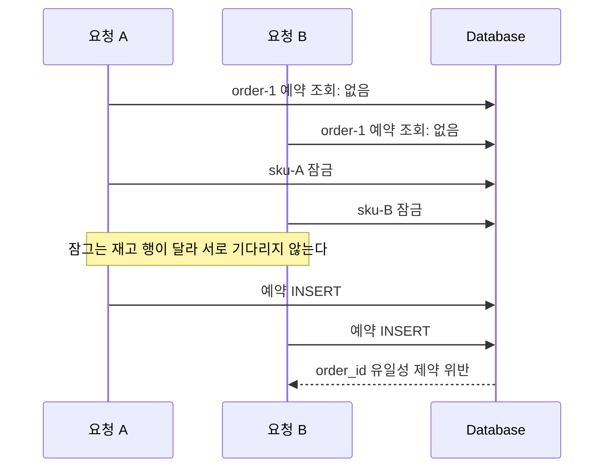
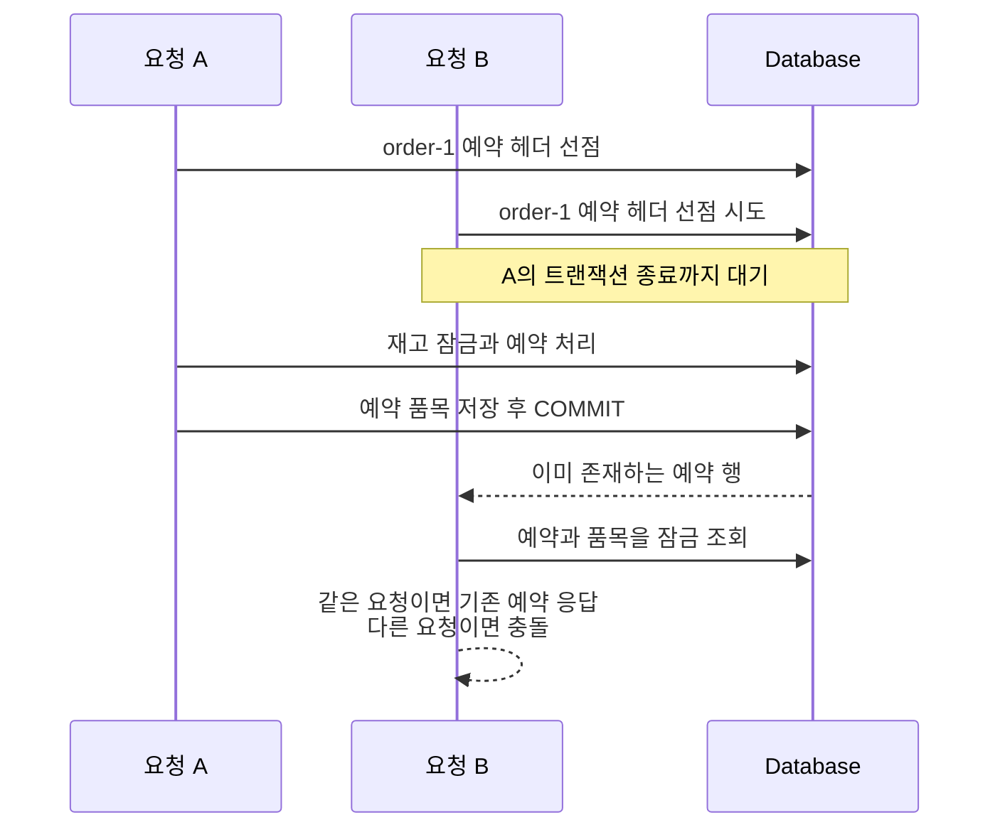

## 들어가며

같은 주문의 재고 예약 요청이 동시에 들어와도 예약은 하나만 저장됐고 재고도 한 번만 반영됐다. 데이터만 보면 멱등했다. 하지만 경쟁에서 진 요청은 기존 예약이 아니라 데이터베이스 중복 예외를 받았다.

재고 예약 API는 같은 주문으로 여러 번 호출될 수 있다. 네트워크 타임아웃 뒤 클라이언트가 재시도할 수도 있고, 메시지 소비자가 같은 사건을 다시 처리할 수도 있다. 이때 같은 주문과 같은 품목을 요청했다면 이미 만든 예약을 돌려주고, 다른 품목이나 수량을 요청했다면 충돌로 거절해야 한다. 어느 경우에도 재고는 한 번만 예약되어야 한다.

처음 구현도 이 규칙을 의식하고 있었다. 주문 ID로 기존 예약을 찾고, 없으면 재고 행을 `SELECT ... FOR UPDATE`로 잠근 뒤 다시 예약을 조회했다. 재고 변경은 잠금 안에서 일어나고 주문 ID에는 유일성 제약도 있었으므로 충분해 보였다.

주문 ID의 유일성 제약은 중복 예약을 막았고, 패배한 트랜잭션의 재고 변경도 함께 롤백했다. 데이터 무결성에는 문제가 없었다. 지켜지지 않은 것은 같은 요청에 같은 예약을 돌려준다는 인터페이스 계약이었다.

이 글은 재고 행 잠금으로도 해결되지 않았던 이유, 실제로 직렬화해야 했던 대상, 검토한 대안과 예약행 선점 방식을 선택한 과정을 정리한다.

## 지켜야 했던 규칙

먼저 동시성 제어가 보장해야 할 결과를 세 가지로 고정했다.

| 요청 | 결과 |
| --- | --- |
| 같은 주문, 같은 품목과 수량 | 모든 호출이 같은 예약을 받는다 |
| 같은 주문, 다른 품목 또는 수량 | 하나만 성공하고 나머지는 충돌로 끝난다 |
| 어느 경우든 | 재고 예약 수량은 한 번만 증가한다 |

여기서 중요한 것은 데이터베이스에 예약이 하나만 남는 것만으로는 부족하다는 점이다. 유일성 제약이 중복 행을 막더라도 패배한 요청이 SQL 예외를 그대로 받으면 인터페이스 규칙은 지켜지지 않는다.

멱등성은 단순히 “중복 데이터가 생기지 않는다”가 아니다. 같은 의도를 반복했을 때 호출자까지 약속된 결과를 받아야 한다.

## 재고 행을 잠그면 충분하다고 생각했다

기존 흐름은 다음과 같았다.

```text
1. order_id로 기존 예약 조회
2. 없으면 요청한 SKU의 재고 행을 FOR UPDATE로 잠금
3. order_id로 기존 예약 재조회
4. 여전히 없으면 재고 수량 변경
5. 예약 저장
```

같은 SKU를 예약하는 두 요청은 같은 재고 행에서 만나므로 얼핏 직렬화된다. 첫 번째 트랜잭션이 재고 행을 잡고 있으면 두 번째 트랜잭션이 기다리기 때문이다.

그러나 이 흐름은 **재고 수량**만 보호한다. 우리가 지켜야 할 또 다른 불변식은 “한 주문에는 예약이 하나뿐이다”인데, 그 불변식의 기준은 SKU가 아니라 주문 ID다.

문제는 요청 품목이 다를 때 더 분명해진다.



두 요청은 서로 다른 재고 행을 잠그므로 동시에 예약 생성까지 갈 수 있다. 주문 ID의 유일성 제약 덕분에 두 예약이 모두 저장되지는 않는다. 패배한 트랜잭션의 재고 변경도 롤백된다. 하지만 패배한 호출자는 기존 예약이나 명확한 도메인 충돌 대신 DB 예외를 받는다.

같은 SKU를 요청해도 격리 수준과 조회 방식 때문에 안심할 수 없었다. MySQL InnoDB의 `REPEATABLE READ`에서 일반 `SELECT`는 트랜잭션의 일관된 스냅샷을 읽는다. 앞에서 “예약 없음”을 관측해 스냅샷이 만들어졌다면, 재고 잠금 대기 뒤 같은 일반 조회를 반복해도 먼저 커밋된 예약을 보지 못할 수 있다. `READ COMMITTED`라면 문장마다 새로 커밋된 상태를 읽으므로 두 번째 조회에서 예약을 볼 수 있지만, 정확성을 격리 수준에 기대는 구조가 된다.

반면 MySQL InnoDB의 `SELECT ... FOR UPDATE`는 `REPEATABLE READ`에서도 기존 스냅샷을 다시 보는 일반 조회와 다르게 동작한다. 잠금을 기다린 뒤 현재 커밋된 행을 읽는 잠금 읽기다. 예약행 선점에 실패한 요청이 승자의 커밋 결과를 읽을 수 있는 근거가 여기에 있다. 이 설명은 모든 DBMS와 모든 격리 수준에 대한 일반론이 아니라, 이번에 사용한 MySQL InnoDB의 동작에 한정한다.

결국 “재고 행에서 한 번 기다렸으니 최신 예약도 보겠지”라는 기대에는 근거가 없었다. 잠금은 잠근 대상에 대해서만 순서를 만든다.

## 잠금의 기준을 불변식과 맞추기

이 문제에서 경쟁하는 것은 재고가 아니라 **주문별 예약 생성권**이다. 따라서 같은 주문 ID를 가진 요청들이 반드시 같은 지점에서 만나야 한다.

이 원칙으로 세 가지 방법을 검토했다.

1. 주문 ID로 named lock을 획득한다.
2. 예약 `INSERT`의 중복 예외를 트랜잭션 밖에서 복구한다.
3. 예약 헤더 행을 먼저 삽입해 생성권을 선점한다.

세 방법 모두 주문 ID를 직렬화 기준으로 삼는다. 차이는 순서를 만드는 수단과 트랜잭션 경계다.

## named lock은 명확하지만 연결 수명까지 설계해야 한다

named lock은 주문 ID 같은 문자열을 잠금 키로 사용할 수 있다. 응용 계층에서는 다음과 같은 의미의 포트로 감출 수 있다.

```java
public interface ExclusiveSection {
    <T> T run(String key, Supplier<T> body);
}
```

이 포트의 구현은 MySQL named lock일 수도 있고 Redis 기반 분산 락일 수도 있다. 예약 로직은 잠금 기술을 알 필요 없이 “이 주문 ID의 실행은 겹치지 않아야 한다”고 선언한다.

논리적인 중첩 순서는 잠금 구간 바깥, 트랜잭션 구간 안쪽이다.

```java
exclusiveSection.run(orderId, () ->
    transactionSection.run(() -> reserve(orderId, lines))
);
```

하지만 MySQL의 `GET_LOCK()`은 트랜잭션이 아니라 DB 세션, 즉 커넥션에 귀속된다. 트랜잭션이 끝나도 자동으로 풀리지 않으며 `RELEASE_LOCK()`도 같은 커넥션에서 호출해야 한다.

잠금용 커넥션을 잡은 상태로 내부 트랜잭션이 다른 커넥션을 빌리게 만들면 요청당 두 커넥션이 필요하다. 같은 키를 기다리는 요청들이 잠금 대기 중 커넥션 풀을 차지하면, 정작 잠금을 가진 요청이 트랜잭션용 커넥션을 얻지 못하는 상황도 생길 수 있다.

DB named lock으로 구현하려면 잠금을 얻은 커넥션을 스프링 트랜잭션에 바인딩해 내부 작업이 같은 커넥션을 재사용하도록 만드는 편이 안전하다. 잠금 획득 실패의 응답, 제한 시간, 예외 발생 시 해제도 함께 정해야 한다.

문제는 풀 수 있지만 예약 하나를 위해 관리해야 할 수명과 실패 경로가 늘어난다. 그래서 잠금 구간의 의미를 표현하는 포트까지만 남기고 구현하지 않았다.

## 중복 예외를 새 트랜잭션에서 복구하는 방법

두 번째 방법은 일반 `INSERT`와 `order_id` 유일성 제약을 그대로 이용한다.

```java
try {
    return transactionSection.run(() -> createReservation(orderId, lines));
} catch (ReservationCreationConflictException collision) {
    return transactionSection.run(() -> {
        var existing = repository.findByOrderId(orderId)
                .orElseThrow(() -> collision);
        return validateAndReturn(existing, lines);
    });
}
```

두 요청이 동시에 예약을 만들면 한 트랜잭션만 `INSERT`에 성공한다. 다른 트랜잭션은 유일성 제약 위반으로 끝나고, 그 안에서 수행한 재고 변경도 롤백된다. 예외를 잡은 뒤 새 트랜잭션으로 기존 예약을 조회하면 승자의 커밋 결과를 보고 멱등 응답이나 도메인 충돌로 바꿀 수 있다.

핵심은 **중복 예외를 실패한 트랜잭션 바깥에서 잡는 것**이다. 같은 트랜잭션 안에서 예외를 삼키고 조회를 계속하면 스프링이 이미 트랜잭션을 rollback-only로 표시했을 수 있다. 조회와 응답 객체 생성까지 성공해 보이더라도 마지막 커밋에서 `UnexpectedRollbackException`이 발생할 수 있다.

그래서 이 방식에서는 생성 시도와 충돌 복구 조회가 각각 독립된 트랜잭션이어야 한다. 메서드의 `@Transactional`만으로는 이 구조가 잘 드러나지 않아 `TransactionSection`으로 경계를 명시하는 대안도 구현해 보았다.

이 방식은 충분히 현실적이고 코드의 의도도 분명하다. 다만 경쟁에서 진 요청은 재고 변경까지 수행한 트랜잭션 전체를 롤백하고 새 트랜잭션을 한 번 더 시작한다. 동시 중복이 정상적으로 자주 발생한다면 예외와 롤백이 평상시 제어 흐름이 된다.

또 생성 경로에서는 기존 행을 갱신할 수 있는 저장 메서드 대신 순수 `INSERT`를 써야 한다. 그래야 중복을 명확한 생성 충돌로 관찰하고 실패한 작업 전체를 되돌릴 수 있다.

## 예약 헤더를 생성권으로 사용하다

이번 구현에는 예약 헤더를 재고보다 먼저 삽입하는 방법을 적용했다.

```sql
insert into reservations (id, order_id, status)
values (:id, :order_id, :status)
on duplicate key update id = id
```

`order_id`에는 유일성 제약이 있다. 같은 주문의 두 요청이 이 문장을 실행하면 데이터베이스가 유일 인덱스에서 순서를 만든다.



`ON DUPLICATE KEY UPDATE`는 `INSERT`하려는 값이 기본 키나 유일 인덱스와 충돌하면 새 행을 추가하는 대신 뒤의 `UPDATE` 절을 실행한다. 여기서 `id = id`는 기존 `id` 컬럼의 값을 그대로 대입하므로 행을 실질적으로 바꾸지 않는 no-op이다.

이 구문을 쓴 목적은 중복 요청을 SQL 예외로 종료하지 않으면서 `order_id` 유일 인덱스의 경합에 참여시키는 것이다. 승자가 아직 트랜잭션을 끝내지 않았다면 패자는 같은 유일 인덱스에서 기다린다. 승자가 커밋하면 no-op update 경로로 빠지고, 이어지는 잠금 조회에서 완성된 예약을 읽는다. `ON DUPLICATE KEY UPDATE`는 특정 유일 인덱스만 대상으로 하지 않으므로 어떤 제약이 충돌할 수 있는지는 테이블 전체를 기준으로 확인해야 한다.

예약 헤더를 새로 삽입한 요청은 아직 예약 품목 행이 없다. 이미 완성된 예약을 만난 요청은 품목 행이 있다. 이를 이용해 저장소 포트는 다음 의미를 제공한다.

```java
Optional<Reservation> claimReservation(Reservation candidate);
```

- 후보가 생성권을 얻으면 빈 값을 반환한다.
- 기존 예약이 선점하고 있으면 그 예약을 잠근 채 반환한다.

응용 로직은 기존 예약을 받으면 요청 품목과 비교한다. 같으면 기존 결과를 반환하고 다르면 도메인 충돌을 발생시킨다. 생성권을 얻은 요청만 재고 행을 잠그고 수량을 변경한 뒤 예약 품목을 저장한다.

재고 부족이나 존재하지 않는 SKU 때문에 작업이 실패하면 예약 헤더 삽입도 같은 트랜잭션에서 롤백된다. 빈 선점 행이 남지 않으므로 이후의 정상 요청을 막지 않는다.

## 데드락을 피하려면 잠금 순서도 같아야 한다

주문 ID를 먼저 직렬화했다고 해서 재고 잠금의 순서가 중요하지 않은 것은 아니다. 하나의 예약이 여러 SKU를 포함하면 두 트랜잭션이 같은 재고 집합을 반대 순서로 잠글 수 있다.

```text
요청 A: sku-1 잠금 → sku-2 대기
요청 B: sku-2 잠금 → sku-1 대기
```

그래서 재고 행은 항상 SKU ID 순서로 정렬해 잠근다. 예약 생성, 확정, 해제도 예약 행을 먼저 잠근 뒤 정렬된 재고 행을 잠그는 순서를 공유한다. 동시성 제어에서는 “무엇을 잠그는가”와 함께 “어떤 순서로 잠그는가”가 규칙이어야 한다.

## 경쟁 조건을 재현하는 테스트

동시성 테스트를 단순히 두 스레드에서 여러 번 실행하면 대부분은 한 요청이 조회부터 저장까지 끝난 뒤 다른 요청이 시작한다. 테스트가 통과해도 문제가 없는 것인지 경쟁 구간을 만나지 못한 것인지 알 수 없다.

테스트에서는 두 개의 `REPEATABLE READ` 트랜잭션이 먼저 “해당 주문의 예약이 없다”는 스냅샷을 각각 만들게 했다. 두 실행이 준비됐음을 `CountDownLatch`로 확인한 뒤 동시에 예약 로직으로 진입시켰다.

검증한 경쟁은 두 가지였다.

- 같은 주문과 같은 품목을 동시에 예약하면 두 결과의 예약 ID가 같고 재고가 한 번만 예약된다.
- 같은 주문에 서로 다른 SKU를 동시에 예약하면 하나만 성공하고 다른 하나는 충돌하며 패자의 SKU 재고는 바뀌지 않는다.

재고 부족과 존재하지 않는 SKU로 실패했을 때 예약 헤더가 남지 않는지도 확인했다. 선점 행을 먼저 만드는 구조에서는 성공 경로만큼 롤백 경로가 중요하기 때문이다.

## 마치며

처음에는 재고가 바뀌니 재고를 잠그면 된다고 생각했다. 하지만 잠금 대상은 변경되는 데이터가 아니라 **지키려는 불변식의 기준**에서 찾아야 했다. 재고 수량의 불변식은 SKU 행 잠금이 지켰지만, 주문별 예약 유일성은 주문 ID에서 별도의 순서를 만들어야 했다.

유일성 제약은 중복 데이터를 막는 최후 방어선일 뿐 호출자에게 멱등 결과까지 만들어 주지는 않는다. 패배한 요청을 어떤 도메인 결과로 번역할지 애플리케이션이 결정해야 한다.

중복 예외를 트랜잭션 밖에서 잡아 새 트랜잭션으로 복구하는 방식도 실용적이었다. `TransactionSection`으로 경계를 드러내면 구현도 복잡하지 않았다. 예약행 선점과 중복 예외 복구는 모두 요구사항을 만족하며 서로 다른 비용을 가진다. 이번 구현에서는 재고를 변경하기 전에 주문별 경쟁 결과를 정하고, 하나의 트랜잭션 안에서 중복 요청을 정상 흐름으로 처리하는 예약행 선점을 적용했다. 이는 언제나 더 나은 해법이라는 결론이 아니라 이번 구현에서 선택한 트레이드오프다.

마지막으로 동시성 문제는 결과만 검증해서는 부족하다. 두 실행을 문제가 발생하는 스냅샷과 시점에 세워 놓아야 테스트가 설계의 근거가 된다. 이번 해결에서 가장 오래 남을 교훈은 SQL 구문 하나보다도 **불변식, 잠금 대상, 트랜잭션 경계, 테스트의 경쟁 지점을 같은 이야기로 연결해야 한다**는 점이었다.
